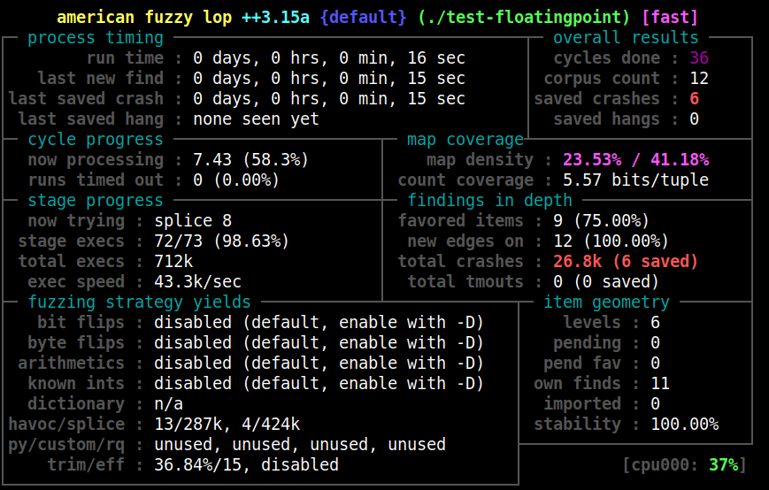

# Fuzzing with AFL++

The following describes how to fuzz with a target if source code is available.
If you have a binary-only target, go to
[fuzzing_binary-only_targets.md](fuzzing_binary-only_targets.md).

Fuzzing source code is a three-step process:

1. Compile the target with a special compiler that prepares the target to be
   fuzzed efficiently. This step is called "instrumenting a target".
2. Prepare the fuzzing by selecting and optimizing the input corpus for the
   target.
3. Perform the fuzzing of the target by randomly mutating input and assessing if
   that input was processed on a new path in the target binary.

## 0. Common sense risks

Please keep in mind that, similarly to many other computationally-intensive
tasks, fuzzing may put a strain on your hardware and on the OS. In particular:

- Your CPU will run hot and will need adequate cooling. In most cases, if
  cooling is insufficient or stops working properly, CPU speeds will be
  automatically throttled. That said, especially when fuzzing on less suitable
  hardware (laptops, smartphones, etc.), it's not entirely impossible for
  something to blow up.

- Targeted programs may end up erratically grabbing gigabytes of memory or
  filling up disk space with junk files. AFL++ tries to enforce basic memory
  limits, but can't prevent each and every possible mishap. The bottom line is
  that you shouldn't be fuzzing on systems where the prospect of data loss is
  not an acceptable risk.

- Fuzzing involves billions of reads and writes to the filesystem. On modern
  systems, this will be usually heavily cached, resulting in fairly modest
  "physical" I/O - but there are many factors that may alter this equation. It
  is your responsibility to monitor for potential trouble; with very heavy I/O,
  the lifespan of many HDDs and SSDs may be reduced.

  A good way to monitor disk I/O on Linux is the `iostat` command:

  ```shell
  $ iostat -d 3 -x -k [...optional disk ID...]
  ```

  Using the `AFL_TMPDIR` environment variable and a RAM-disk, you can have the
  heavy writing done in RAM to prevent the aforementioned wear and tear. For
  example, the following line will run a Docker container with all this preset:

  ```shell
  # docker run -ti --mount type=tmpfs,destination=/ramdisk -e AFL_TMPDIR=/ramdisk aflplusplus/aflplusplus
  ```

## 1. Instrumenting the target

### a) Selecting the best AFL++ compiler for instrumenting the target

AFL++ comes with a central compiler `afl-cc` that incorporates various different
kinds of compiler targets and instrumentation options. The following
evaluation flow will help you to select the best possible.

It is highly recommended to have the newest llvm version possible installed,
anything below 9 is not recommended.

```
+--------------------------------+
| clang/clang++ 11+ is available | --> use LTO mode (afl-clang-lto/afl-clang-lto++)
+--------------------------------+     see [instrumentation/README.lto.md](instrumentation/README.lto.md)
    |
    | if not, or if the target fails with LTO afl-clang-lto/++
    |
    v
+---------------------------------+
| clang/clang++ 3.8+ is available | --> use LLVM mode (afl-clang-fast/afl-clang-fast++)
+---------------------------------+     see [instrumentation/README.llvm.md](instrumentation/README.llvm.md)
    |
    | if not, or if the target fails with LLVM afl-clang-fast/++
    |
    v
 +--------------------------------+
 | gcc 5+ is available            | -> use GCC_PLUGIN mode (afl-gcc-fast/afl-g++-fast)
 +--------------------------------+    see [instrumentation/README.gcc_plugin.md](instrumentation/README.gcc_plugin.md) and
                                       [instrumentation/README.instrument_list.md](instrumentation/README.instrument_list.md)
    |
    | if not, or if you do not have a gcc with plugin support
    |
    v
   use GCC mode (afl-gcc/afl-g++) (or afl-clang/afl-clang++ for clang)
```

Clickable README links for the chosen compiler:

* [LTO mode - afl-clang-lto](../instrumentation/README.lto.md)
* [LLVM mode - afl-clang-fast](../instrumentation/README.llvm.md)
* [GCC_PLUGIN mode - afl-gcc-fast](../instrumentation/README.gcc_plugin.md)
* GCC/CLANG modes (afl-gcc/afl-clang) have no README as they have no own
  features

You can select the mode for the afl-cc compiler by one of the following methods:

* Using a symlink to afl-cc: afl-gcc, afl-g++, afl-clang, afl-clang++,
   afl-clang-fast, afl-clang-fast++, afl-clang-lto, afl-clang-lto++,
   afl-gcc-fast, afl-g++-fast (recommended!).
* Using the environment variable `AFL_CC_COMPILER` with `MODE`.
* Passing --afl-`MODE` command line options to the compiler via
   `CFLAGS`/`CXXFLAGS`/`CPPFLAGS`.

`MODE` can be one of the following:

* LTO (afl-clang-lto*)
* LLVM (afl-clang-fast*)
* GCC_PLUGIN (afl-g*-fast) or GCC (afl-gcc/afl-g++)
* CLANG(afl-clang/afl-clang++)

Because no AFL++ specific command-line options are accepted (beside the
--afl-MODE command), the compile-time tools make fairly broad use of environment
variables, which can be listed with `afl-cc -hh` or looked up in
[env_variables.md](env_variables.md).

### b) Selecting instrumentation options

If you instrument with LTO mode (afl-clang-fast/afl-clang-lto), the following
options are available:

* Splitting integer, string, float, and switch comparisons so AFL++ can easier
  solve these. This is an important option if you do not have a very good and
  large input corpus. This technique is called laf-intel or COMPCOV. To use
  this, set the following environment variable before compiling the target:
  `export AFL_LLVM_LAF_ALL=1`. You can read more about this in
  [instrumentation/README.laf-intel.md](../instrumentation/README.laf-intel.md).
* A different technique (and usually a better one than laf-intel) is to
  instrument the target so that any compare values in the target are sent to
  AFL++ which then tries to put these values into the fuzzing data at different
  locations. This technique is very fast and good - if the target does not
  transform input data before comparison. Therefore, this technique is called
  `input to state` or `redqueen`. If you want to use this technique, then you
  have to compile the target twice, once specifically with/for this mode by
  setting `AFL_LLVM_CMPLOG=1`, and pass this binary to afl-fuzz via the `-c`
  parameter. Note that you can compile also just a cmplog binary and use that
  for both, however, there will be a performance penalty. You can read more
  about this in
  [instrumentation/README.cmplog.md](../instrumentation/README.cmplog.md).

If you use LTO, LLVM, or GCC_PLUGIN mode
(afl-clang-fast/afl-clang-lto/afl-gcc-fast), you have the option to selectively
instrument _parts_ of the target that you are interested in. For afl-clang-fast,
you have to use an llvm version newer than 10.0.0 or a mode other than
DEFAULT/PCGUARD.

This step can be done either by explicitly including parts to be instrumented or
by explicitly excluding parts from instrumentation.

* To instrument _only specified parts_, create a file (e.g., `allowlist.txt`)
  with all the filenames and/or functions of the source code that should be
  instrumented and then:

  1. Just put one filename or function (prefixing with `fun: `) per line (no
     directory information necessary for filenames) in the file `allowlist.txt`.

     Example:

     ```
     foo.cpp        # will match foo/foo.cpp, bar/foo.cpp, barfoo.cpp etc.
     fun: foo_func  # will match the function foo_func
     ```

  2. Set `export AFL_LLVM_ALLOWLIST=allowlist.txt` to enable selective positive
     instrumentation.

* Similarly to _exclude_ specified parts from instrumentation, create a file
  (e.g., `denylist.txt`) with all the filenames of the source code that should
  be skipped during instrumentation and then:

  1. Same as above. Just put one filename or function per line in the file
     `denylist.txt`.

  2. Set `export AFL_LLVM_DENYLIST=denylist.txt` to enable selective negative
     instrumentation.

**NOTE:** During optimization functions might be
inlined and then would not match the list! See
[instrumentation/README.instrument_list.md](../instrumentation/README.instrument_list.md).

There are many more options and modes available, however, these are most of the
time less effective. See:

* [instrumentation/README.llvm.md#6) AFL++ Context Sensitive Branch Coverage](../instrumentation/README.llvm.md#6-afl-context-sensitive-branch-coverage)
* [instrumentation/README.llvm.md#7) AFL++ N-Gram Branch Coverage](../instrumentation/README.llvm.md#7-afl-n-gram-branch-coverage)

AFL++ performs "never zero" counting in its bitmap. You can read more about this
here:
* [instrumentation/README.llvm.md#8-neverzero-counters](../instrumentation/README.llvm.md#8-neverzero-counters)

### c) Selecting sanitizers

It is possible to use sanitizers when instrumenting targets for fuzzing, which
allows you to find bugs that would not necessarily result in a crash.

Note that sanitizers have a huge impact on CPU (= less executions per second)
and RAM usage. Also, you should only run one afl-fuzz instance per sanitizer
type. This is enough because e.g. a use-after-free bug will be picked up by ASAN
(address sanitizer) anyway after syncing test cases from other fuzzing
instances, so running more than one address sanitized target would be a waste.

The following sanitizers have built-in support in AFL++:

* ASAN = Address SANitizer, finds memory corruption vulnerabilities like
  use-after-free, NULL pointer dereference, buffer overruns, etc. Enabled with
  `export AFL_USE_ASAN=1` before compiling.
* MSAN = Memory SANitizer, finds read accesses to uninitialized memory, e.g., a
  local variable that is defined and read before it is even set. Enabled with
  `export AFL_USE_MSAN=1` before compiling.
* UBSAN = Undefined Behavior SANitizer, finds instances where - by the C and C++
  standards - undefined behavior happens, e.g., adding two signed integers where
  the result is larger than what a signed integer can hold. Enabled with `export
  AFL_USE_UBSAN=1` before compiling.
* CFISAN = Control Flow Integrity SANitizer, finds instances where the control
  flow is found to be illegal. Originally this was rather to prevent return
  oriented programming (ROP) exploit chains from functioning. In fuzzing, this
  is mostly reduced to detecting type confusion vulnerabilities - which is,
  however, one of the most important and dangerous C++ memory corruption
  classes! Enabled with `export AFL_USE_CFISAN=1` before compiling.
* TSAN = Thread SANitizer, finds thread race conditions. Enabled with `export
  AFL_USE_TSAN=1` before compiling.
* LSAN = Leak SANitizer, finds memory leaks in a program. This is not really a
  security issue, but for developers this can be very valuable. Note that unlike
  the other sanitizers above this needs `__AFL_LEAK_CHECK();` added to all areas
  of the target source code where you find a leak check necessary! Enabled with
  `export AFL_USE_LSAN=1` before compiling. To ignore the memory-leaking check
  for certain allocations, `__AFL_LSAN_OFF();` can be used before memory is
  allocated, and `__AFL_LSAN_ON();` afterwards. Memory allocated between these
  two macros will not be checked for memory leaks.

It is possible to further modify the behavior of the sanitizers at run-time by
setting `ASAN_OPTIONS=...`, `LSAN_OPTIONS` etc. - the available parameters can
be looked up in the sanitizer documentation of llvm/clang. afl-fuzz, however,
requires some specific parameters important for fuzzing to be set. If you want
to set your own, it might bail and report what it is missing.

Note that some sanitizers cannot be used together, e.g., ASAN and MSAN, and
others often cannot work together because of target weirdness, e.g., ASAN and
CFISAN. You might need to experiment which sanitizers you can combine in a
target (which means more instances can be run without a sanitized target, which
is more effective).

### d) Modifying the target

If the target has features that make fuzzing more difficult, e.g., checksums,
HMAC, etc., then modify the source code so that checks for these values are
removed. This can even be done safely for source code used in operational
products by eliminating these checks within these AFL++ specific blocks:

```
#ifdef FUZZING_BUILD_MODE_UNSAFE_FOR_PRODUCTION
  // say that the checksum or HMAC was fine - or whatever is required
  // to eliminate the need for the fuzzer to guess the right checksum
  return 0;
#endif
```

All AFL++ compilers will set this preprocessor definition automatically.

### e) Instrumenting the target

In this step, the target source code is compiled so that it can be fuzzed.

Basically, you have to tell the target build system that the selected AFL++
compiler is used. Also - if possible - you should always configure the build
system in such way that the target is compiled statically and not dynamically.
How to do this is described below.

The #1 rule when instrumenting a target is: avoid instrumenting shared libraries
at all cost. You would need to set `LD_LIBRARY_PATH` to point to these, you
could accidentally type "make install" and install them system wide - so don't.
Really don't. **Always compile libraries you want to have instrumented as static
and link these to the target program!**

Then build the target. (Usually with `make`.)

**NOTES**

1. Sometimes configure and build systems are fickle and do not like stderr
   output (and think this means a test failure) - which is something AFL++ likes
   to do to show statistics. It is recommended to disable AFL++ instrumentation
   reporting via `export AFL_QUIET=1`.

2. Sometimes configure and build systems error on warnings - these should be
   disabled (e.g., `--disable-werror` for some configure scripts).

3. In case the configure/build system complains about AFL++'s compiler and
   aborts, then set `export AFL_NOOPT=1` which will then just behave like the
   real compiler and run the configure step separately. For building the target
   afterwards this option has to be unset again!

#### configure

For `configure` build systems, this is usually done by:

```
CC=afl-clang-fast CXX=afl-clang-fast++ ./configure --disable-shared
```

Note that if you are using the (better) afl-clang-lto compiler, you also have to
set `AR` to llvm-ar[-VERSION] and `RANLIB` to llvm-ranlib[-VERSION] - as is
described in [instrumentation/README.lto.md](../instrumentation/README.lto.md).

#### CMake

For CMake build systems, this is usually done by:

```
mkdir build; cd build; cmake -DCMAKE_C_COMPILER=afl-cc -DCMAKE_CXX_COMPILER=afl-c++ ..
```

Note that if you are using the (better) afl-clang-lto compiler you also have to
set AR to llvm-ar[-VERSION] and RANLIB to llvm-ranlib[-VERSION] - as is
described in [instrumentation/README.lto.md](../instrumentation/README.lto.md).

#### Meson Build System

For the Meson Build System, you have to set the AFL++ compiler with the very
first command!

```
CC=afl-cc CXX=afl-c++ meson
```

#### Other build systems or if configure/cmake didn't work

Sometimes `cmake` and `configure` do not pick up the AFL++ compiler or the
`RANLIB`/`AR` that is needed - because this was just not foreseen by the
developer of the target. Or they have non-standard options. Figure out if there
is a non-standard way to set this, otherwise set up the build normally and edit
the generated build environment afterwards manually to point it to the right
compiler (and/or `RANLIB` and `AR`).

In complex, weird, alien build systems you can try this neat project:
[https://github.com/fuzzah/exeptor](https://github.com/fuzzah/exeptor)

#### Linker scripts

If the project uses linker scripts to hide the symbols exported by the
binary, then you may see errors such as:

```
undefined symbol: __afl_area_ptr
```

The solution is to modify the linker script to add:

```
{
  global:
    __afl_*;
}
```

### f) Better instrumentation

If you just fuzz a target program as-is, you are wasting a great opportunity for
much more fuzzing speed.

This variant requires the usage of afl-clang-lto, afl-clang-fast or
afl-gcc-fast.

It is the so-called `persistent mode`, which is much, much faster but requires
that you code a source file that is specifically calling the target functions
that you want to fuzz, plus a few specific AFL++ functions around it. See
[instrumentation/README.persistent_mode.md](../instrumentation/README.persistent_mode.md)
for details.

Basically, if you do not fuzz a target in persistent mode, then you are just
doing it for a hobby and not professionally :-).

### g) libfuzzer fuzzer harnesses with LLVMFuzzerTestOneInput()

libfuzzer `LLVMFuzzerTestOneInput()` harnesses are the defacto standard for
fuzzing, and they can be used with AFL++ (and honggfuzz) as well!

Compiling them is as simple as:

```
afl-clang-fast++ -fsanitize=fuzzer -o harness harness.cpp targetlib.a
```

You can even use advanced libfuzzer features like `FuzzedDataProvider`,
`LLVMFuzzerInitialize()` etc. and they will work!

The generated binary is fuzzed with afl-fuzz like any other fuzz target.

Bonus: the target is already optimized for fuzzing due to persistent mode and
shared-memory test cases and hence gives you the fastest speed possible.

For more information, see
[utils/aflpp_driver/README.md](../utils/aflpp_driver/README.md).

## 2. Preparing the fuzzing campaign

As you fuzz the target with mutated input, having as diverse inputs for the
target as possible improves the efficiency a lot.

### a) Collecting inputs

To operate correctly, the fuzzer requires one or more starting files that
contain a good example of the input data normally expected by the targeted
application.

Try to gather valid inputs for the target from wherever you can. E.g., if it is
the PNG picture format, try to find as many PNG files as possible, e.g., from
reported bugs, test suites, random downloads from the internet, unit test case
data - from all kind of PNG software.

If the input format is not known, you can also modify a target program to write
normal data it receives and processes to a file and use these.

You can find many good examples of starting files in the
[testcases/](../testcases) subdirectory that comes with this tool.

### b) Making the input corpus unique

Use the AFL++ tool `afl-cmin` to remove inputs from the corpus that do not
produce a new path/coverage in the target:

1. Put all files from [step a](#a-collecting-inputs) into one directory, e.g.,
   `INPUTS`.
2. Run afl-cmin:
   * If the target program is to be called by fuzzing as `bin/target INPUTFILE`,
     replace the INPUTFILE argument that the target program would read from with
     `@@`:

     ```
     afl-cmin -i INPUTS -o INPUTS_UNIQUE -- bin/target -someopt @@
     ```

   * If the target reads from stdin (standard input) instead, just omit the `@@`
     as this is the default:

     ```
     afl-cmin -i INPUTS -o INPUTS_UNIQUE -- bin/target -someopt
     ```

This step is highly recommended, because afterwards the testcase corpus is not
bloated with duplicates anymore, which would slow down the fuzzing progress!

### c) Minimizing all corpus files

The shorter the input files that still traverse the same path within the target,
the better the fuzzing will be. This minimization is done with `afl-tmin`,
however, it is a long process as this has to be done for every file:

```
mkdir input
cd INPUTS_UNIQUE
for i in *; do
  afl-tmin -i "$i" -o "../input/$i" -- bin/target -someopt @@
done
```

This step can also be parallelized, e.g., with `parallel`.

Note that this step is rather optional though.

### Done!

The INPUTS_UNIQUE/ directory from [step b](#b-making-the-input-corpus-unique) -
or even better the directory input/ if you minimized the corpus in
[step c](#c-minimizing-all-corpus-files) - is the resulting input corpus
directory to be used in fuzzing! :-)

## 3. Fuzzing the target

In this final step, fuzz the target. There are not that many important options
to run the target - unless you want to use many CPU cores/threads for the
fuzzing, which will make the fuzzing much more useful.

If you just use one instance for fuzzing, then you are fuzzing just for fun and
not seriously :-)

### a) Running afl-fuzz

Before you do even a test run of afl-fuzz, execute `sudo afl-system-config` (on
the host if you execute afl-fuzz in a Docker container). This reconfigures the
system for optimal speed - which afl-fuzz checks and bails otherwise. Set
`export AFL_SKIP_CPUFREQ=1` for afl-fuzz to skip this check if you cannot run
afl-system-config with root privileges on the host for whatever reason.

Note:

* There is also `sudo afl-persistent-config` which sets additional permanent
  boot options for a much better fuzzing performance.
* Both scripts improve your fuzzing performance but also decrease your system
  protection against attacks! So set strong firewall rules and only expose SSH
  as a network service if you use these (which is highly recommended).

If you have an input corpus from [step 2](#2-preparing-the-fuzzing-campaign),
then specify this directory with the `-i` option. Otherwise, create a new
directory and create a file with any content as test data in there.

If you do not want anything special, the defaults are already usually best,
hence all you need is to specify the seed input directory with the result of
step [2a) Collecting inputs](#a-collecting-inputs):

```
afl-fuzz -i input -o output -- bin/target -someopt @@
```

Note that the directory specified with `-o` will be created if it does not
exist.

It can be valuable to run afl-fuzz in a `screen` or `tmux` shell so you can log
off, or afl-fuzz is not aborted if you are running it in a remote ssh session
where the connection fails in between. Only do that though once you have
verified that your fuzzing setup works! Run it like `screen -dmS afl-main --
afl-fuzz -M main-$HOSTNAME -i ...` and it will start away in a screen session.
To enter this session, type `screen -r afl-main`. You see - it makes sense to
name the screen session same as the afl-fuzz `-M`/`-S` naming :-) For more
information on screen or tmux, check their documentation.

If you need to stop and re-start the fuzzing, use the same command line options
(or even change them by selecting a different power schedule or another mutation
mode!) and switch the input directory with a dash (`-`):

```
afl-fuzz -i - -o output -- bin/target -someopt @@
```

Adding a dictionary is helpful. You have the following options:

* See the directory
[dictionaries/](../dictionaries/), if something is already included for your
data format, and tell afl-fuzz to load that dictionary by adding `-x
dictionaries/FORMAT.dict`.
* With `afl-clang-lto`, you have an autodictionary generation for which you need
  to do nothing except to use afl-clang-lto as the compiler.
* With `afl-clang-fast`, you can set
  `AFL_LLVM_DICT2FILE=/full/path/to/new/file.dic` to automatically generate a
  dictionary during target compilation.
  Adding `AFL_LLVM_DICT2FILE_NO_MAIN=1` to not parse main (usually command line
  parameter parsing) is often a good idea too.
* You also have the option to generate a dictionary yourself during an
  independent run of the target, see
  [utils/libtokencap/README.md](../utils/libtokencap/README.md).
* Finally, you can also write a dictionary file manually, of course.

afl-fuzz has a variety of options that help to workaround target quirks like
very specific locations for the input file (`-f`), performing deterministic
fuzzing (`-D`) and many more. Check out `afl-fuzz -h`.

We highly recommend that you set a memory limit for running the target with `-m`
which defines the maximum memory in MB. This prevents a potential out-of-memory
problem for your system plus helps you detect missing `malloc()` failure
handling in the target. Play around with various `-m` values until you find one
that safely works for all your input seeds (if you have good ones and then
double or quadruple that).

By default, afl-fuzz never stops fuzzing. To terminate AFL++, press Control-C or
send a signal SIGINT. You can limit the number of executions or approximate
runtime in seconds with options also.

When you start afl-fuzz, you will see a user interface that shows what the
status is:



All labels are explained in
[afl-fuzz_approach.md#understanding-the-status-screen](afl-fuzz_approach.md#understanding-the-status-screen).

### b) Keeping memory use and timeouts in check

Memory limits are not enforced by afl-fuzz by default and the system may run out
of memory. You can decrease the memory with the `-m` option, the value is in MB.
If this is too small for the target, you can usually see this by afl-fuzz
bailing with the message that it could not connect to the forkserver.

Consider setting low values for `-m` and `-t`.

For programs that are nominally very fast, but get sluggish for some inputs, you
can also try setting `-t` values that are more punishing than what `afl-fuzz`
dares to use on its own. On fast and idle machines, going down to `-t 5` may be
a viable plan.

The `-m` parameter is worth looking at, too. Some programs can end up spending a
fair amount of time allocating and initializing megabytes of memory when
presented with pathological inputs. Low `-m` values can make them give up sooner
and not waste CPU time.

### c) Using multiple cores

If you want to seriously fuzz, then use as many cores/threads as possible to
fuzz your target.

On the same machine - due to the design of how AFL++ works - there is a maximum
number of CPU cores/threads that are useful, use more and the overall
performance degrades instead. This value depends on the target, and the limit is
between 32 and 64 cores per machine.

If you have the RAM, it is highly recommended run the instances with a caching
of the test cases. Depending on the average test case size (and those found
during fuzzing) and their number, a value between 50-500MB is recommended. You
can set the cache size (in MB) by setting the environment variable
`AFL_TESTCACHE_SIZE`.

There should be one main fuzzer (`-M main-$HOSTNAME` option - set also
`AFL_FINAL_SYNC=1`) and as many secondary fuzzers (e.g., `-S variant1`) as you
have cores that you use. Every `-M`/`-S` entry needs a unique name (that can be
whatever), however, the same `-o` output directory location has to be used for
all instances.

For every secondary fuzzer there should be a variation, e.g.:
* one should fuzz the target that was compiled with sanitizers activated
  (`export AFL_USE_ASAN=1 ; export AFL_USE_UBSAN=1 ; export AFL_USE_CFISAN=1`)
* one or two should fuzz the target with CMPLOG/redqueen (see above), at least
  one cmplog instance should follow transformations (`-l 2AT`)
* one to three fuzzers should fuzz a target compiled with laf-intel/COMPCOV (see
  above). Important note: If you run more than one laf-intel/COMPCOV fuzzer and
  you want them to share their intermediate results, the main fuzzer (`-M`) must
  be one of them (although this is not really recommended).

The other secondaries should be run like this:
* 10% with the MOpt mutator enabled: `-L 0`
* 10% should use the old queue cycling with `-Z`
* 50-70% should run with `AFL_DISABLE_TRIM`
* 40% should run with `-P explore` and 20% with `-P exploit`
* If you use `-a` then set 30% of the instances to not use `-a`; if you did
  not set `-a` (why??), then set 30% to `-a ascii` and 30% to `-a binary`.
* run each with a different power schedule, recommended are: `fast` (default),
  `explore`, `coe`, `lin`, `quad`, `exploit`, and `rare` which you can set with
  the `-p` option, e.g., `-p explore`. See the
  [FAQ](FAQ.md#what-are-power-schedules) for details.

It can be useful to set `AFL_IGNORE_SEED_PROBLEMS=1` to skip over seeds that
crash or timeout during startup.

Also, it is recommended to set `export AFL_IMPORT_FIRST=1` to load test cases
from other fuzzers in the campaign first. But note that can slow down the start
of the first fuzz by quite a lot if you have many fuzzers and/or many seeds.

If you have a large corpus, a corpus from a previous run or are fuzzing in a CI,
then also set `export AFL_CMPLOG_ONLY_NEW=1` and `export AFL_FAST_CAL=1`.
If the queue in the CI is huge and/or the execution time is slow then you can
also add `AFL_NO_STARTUP_CALIBRATION=1` to skip the initial queue calibration
phase and start fuzzing at once - but only do this if the calibration phase
would be too long for your fuzz run time.

You can also use different fuzzers. If you are using AFL spinoffs or AFL
conforming fuzzers, then just use the same -o directory and give it a unique
`-S` name. Examples are:
* [Fuzzolic](https://github.com/season-lab/fuzzolic)
* [symcc](https://github.com/eurecom-s3/symcc/)
* [Eclipser](https://github.com/SoftSec-KAIST/Eclipser/)
* [AFLsmart](https://github.com/aflsmart/aflsmart)
* [FairFuzz](https://github.com/carolemieux/afl-rb)
* [Neuzz](https://github.com/Dongdongshe/neuzz)
* [Angora](https://github.com/AngoraFuzzer/Angora)

A long list can be found at
[https://github.com/Microsvuln/Awesome-AFL](https://github.com/Microsvuln/Awesome-AFL).

However, you can also sync AFL++ with honggfuzz, libfuzzer with `-entropic=1`,
etc. Just show the main fuzzer (`-M`) with the `-F` option where the queue/work
directory of a different fuzzer is, e.g., `-F /src/target/honggfuzz`. Using
honggfuzz (with `-n 1` or `-n 2`) and libfuzzer in parallel is highly
recommended!

### d) Using multiple machines for fuzzing

Maybe you have more than one machine you want to fuzz the same target on. Start
the `afl-fuzz` (and perhaps libfuzzer, honggfuzz, ...) orchestra as you like,
just ensure that your have one and only one `-M` instance per server, and that
its name is unique, hence the recommendation for `-M main-$HOSTNAME`.

Now there are three strategies on how you can sync between the servers:
* never: sounds weird, but this makes every server an island and has the chance
  that each follow different paths into the target. You can make this even more
  interesting by even giving different seeds to each server.
* regularly (~4h): this ensures that all fuzzing campaigns on the servers "see"
  the same thing. It is like fuzzing on a huge server.
* in intervals of 1/10th of the overall expected runtime of the fuzzing you
  sync. This tries a bit to combine both. Have some individuality of the paths
  each campaign on a server explores, on the other hand if one gets stuck where
  another found progress this is handed over making it unstuck.

The syncing process itself is very simple. As the `-M main-$HOSTNAME` instance
syncs to all `-S` secondaries as well as to other fuzzers, you have to copy only
this directory to the other machines.

Let's say all servers have the `-o out` directory in /target/foo/out, and you
created a file `servers.txt` which contains the hostnames of all participating
servers, plus you have an ssh key deployed to all of them, then run:

```bash
for FROM in `cat servers.txt`; do
  for TO in `cat servers.txt`; do
    rsync -rlpogtz --rsh=ssh $FROM:/target/foo/out/main-$FROM $TO:target/foo/out/
  done
done
```

You can run this manually, per cron job - as you need it. There is a more
complex and configurable script in
[utils/distributed_fuzzing](../utils/distributed_fuzzing).

### e) The status of the fuzz campaign

AFL++ comes with the `afl-whatsup` script to show the status of the fuzzing
campaign.

Just supply the directory that afl-fuzz is given with the `-o` option and you
will see a detailed status of every fuzzer in that campaign plus a summary.

To have only the summary, use the `-s` switch, e.g., `afl-whatsup -s out/`.

If you have multiple servers, then use the command after a sync or you have to
execute this script per server.

Another tool to inspect the current state and history of a specific instance is
afl-plot, which generates an index.html file and graphs that show how the
fuzzing instance is performing. The syntax is `afl-plot instance_dir web_dir`,
e.g., `afl-plot out/default /srv/www/htdocs/plot`.

### f) Stopping fuzzing, restarting fuzzing, adding new seeds

To stop an afl-fuzz run, press Control-C.

To restart an afl-fuzz run, just reuse the same command line but replace the `-i
directory` with `-i -` or set `AFL_AUTORESUME=1`.

If you want to add new seeds to a fuzzing campaign, you can run a temporary
fuzzing instance, e.g., when your main fuzzer is using `-o out` and the new
seeds are in `newseeds/` directory:

```
AFL_BENCH_JUST_ONE=1 AFL_FAST_CAL=1 afl-fuzz -i newseeds -o out -S newseeds -- ./target
```

### g) Checking the coverage of the fuzzing

The `corpus count` value is a bad indicator for checking how good the coverage
is.

A better indicator - if you use default llvm instrumentation with at least
version 9 - is to use `afl-showmap` with the collect coverage option `-C` on the
output directory:

```
$ afl-showmap -C -i out -o /dev/null -- ./target -params @@
...
[*] Using SHARED MEMORY FUZZING feature.
[*] Target map size: 9960
[+] Processed 7849 input files.
[+] Captured 4331 tuples (highest value 255, total values 67130596) in '/dev/nul
l'.
[+] A coverage of 4331 edges were achieved out of 9960 existing (43.48%) with 7849 input files.
```

It is even better to check out the exact lines of code that have been reached -
and which have not been found so far.

An "easy" helper script for this is
[https://github.com/vanhauser-thc/afl-cov](https://github.com/vanhauser-thc/afl-cov),
just follow the README of that separate project.

If you see that an important area or a feature has not been covered so far, then
try to find an input that is able to reach that and start a new secondary in
that fuzzing campaign with that seed as input, let it run for a few minutes,
then terminate it. The main node will pick it up and make it available to the
other secondary nodes over time. Set `export AFL_NO_AFFINITY=1` or `export
AFL_TRY_AFFINITY=1` if you have no free core.

Note that in nearly all cases you can never reach full coverage. A lot of
functionality is usually dependent on exclusive options that would need
individual fuzzing campaigns each with one of these options set. E.g., if you
fuzz a library to convert image formats and your target is the png to tiff API,
then you will not touch any of the other library APIs and features.

### h) How long to fuzz a target?

This is a difficult question. Basically, if no new path is found for a long time
(e.g., for a day or a week), then you can expect that your fuzzing won't be
fruitful anymore. However, often this just means that you should switch out
secondaries for others, e.g., custom mutator modules, sync to very different
fuzzers, etc.

Keep the queue/ directory (for future fuzzings of the same or similar targets)
and use them to seed other good fuzzers like libfuzzer with the -entropic switch
or honggfuzz.

### i) Improve the speed!

* Use [persistent mode](../instrumentation/README.persistent_mode.md) (x2-x20
  speed increase).
* If you do not use shmem persistent mode, use `AFL_TMPDIR` to point the input
  file on a tempfs location, see [env_variables.md](env_variables.md).
* Linux: Improve kernel performance: modify `/etc/default/grub`, set
  `GRUB_CMDLINE_LINUX_DEFAULT="ibpb=off ibrs=off kpti=off l1tf=off mds=off
  mitigations=off no_stf_barrier noibpb noibrs nopcid nopti
  nospec_store_bypass_disable nospectre_v1 nospectre_v2 pcid=off pti=off
  spec_store_bypass_disable=off spectre_v2=off stf_barrier=off"`; then
  `update-grub` and `reboot` (warning: makes the system more insecure) - you can
  also just run `sudo afl-persistent-config`.
* Linux: Running on an `ext2` filesystem with `noatime` mount option will be a
  bit faster than on any other journaling filesystem.
* Use your cores! See [3c) Using multiple cores](#c-using-multiple-cores).
* Run `sudo afl-system-config` before starting the first afl-fuzz instance after
  a reboot.

### j) Going beyond crashes

Fuzzing is a wonderful and underutilized technique for discovering non-crashing
design and implementation errors, too. Quite a few interesting bugs have been
found by modifying the target programs to call `abort()` when say:

- Two bignum libraries produce different outputs when given the same
  fuzzer-generated input.

- An image library produces different outputs when asked to decode the same
  input image several times in a row.

- A serialization/deserialization library fails to produce stable outputs when
  iteratively serializing and deserializing fuzzer-supplied data.

- A compression library produces an output inconsistent with the input file when
  asked to compress and then decompress a particular blob.

Implementing these or similar sanity checks usually takes very little time; if
you are the maintainer of a particular package, you can make this code
conditional with `#ifdef FUZZING_BUILD_MODE_UNSAFE_FOR_PRODUCTION` (a flag also
shared with libfuzzer and honggfuzz) or `#ifdef __AFL_COMPILER` (this one is
just for AFL++).

### k) Known limitations & areas for improvement

Here are some of the most important caveats for AFL++:

- AFL++ detects faults by checking for the first spawned process dying due to a
  signal (SIGSEGV, SIGABRT, etc.). Programs that install custom handlers for
  these signals may need to have the relevant code commented out. In the same
  vein, faults in child processes spawned by the fuzzed target may evade
  detection unless you manually add some code to catch that.

- As with any other brute-force tool, the fuzzer offers limited coverage if
  encryption, checksums, cryptographic signatures, or compression are used to
  wholly wrap the actual data format to be tested.

  To work around this, you can comment out the relevant checks (see
  utils/libpng_no_checksum/ for inspiration); if this is not possible, you can
  also write a postprocessor, one of the hooks of custom mutators. See
  [custom_mutators.md](custom_mutators.md) on how to use
  `AFL_CUSTOM_MUTATOR_LIBRARY`.

- There are some unfortunate trade-offs with ASAN and 64-bit binaries. This
  isn't due to any specific fault of afl-fuzz.

- There is no direct support for fuzzing network services, background daemons,
  or interactive apps that require UI interaction to work. You may need to make
  simple code changes to make them behave in a more traditional way. Preeny or
  libdesock may offer a relatively simple option, too - see:
  [https://github.com/zardus/preeny](https://github.com/zardus/preeny) or
  [https://github.com/fkie-cad/libdesock](https://github.com/fkie-cad/libdesock)

  Some useful tips for modifying network-based services can be also found at:
  [https://www.fastly.com/blog/how-to-fuzz-server-american-fuzzy-lop](https://www.fastly.com/blog/how-to-fuzz-server-american-fuzzy-lop)

- Occasionally, sentient machines rise against their creators. If this happens
  to you, please consult
  [https://lcamtuf.coredump.cx/prep/](https://lcamtuf.coredump.cx/prep/).

Beyond this, see [INSTALL.md](INSTALL.md) for platform-specific tips.

## 4. Triaging crashes

The coverage-based grouping of crashes usually produces a small data set that
can be quickly triaged manually or with a very simple GDB or Valgrind script.
Every crash is also traceable to its parent non-crashing test case in the queue,
making it easier to diagnose faults.

Having said that, it's important to acknowledge that some fuzzing crashes can be
difficult to quickly evaluate for exploitability without a lot of debugging and
code analysis work. To assist with this task, afl-fuzz supports a very unique
"crash exploration" mode enabled with the `-C` flag.

In this mode, the fuzzer takes one or more crashing test cases as the input and
uses its feedback-driven fuzzing strategies to very quickly enumerate all code
paths that can be reached in the program while keeping it in the crashing state.

Mutations that do not result in a crash are rejected; so are any changes that do
not affect the execution path.

The output is a small corpus of files that can be very rapidly examined to see
what degree of control the attacker has over the faulting address, or whether it
is possible to get past an initial out-of-bounds read - and see what lies
beneath.

Oh, one more thing: for test case minimization, give afl-tmin a try. The tool
can be operated in a very simple way:

```shell
./afl-tmin -i test_case -o minimized_result -- /path/to/program [...]
```

The tool works with crashing and non-crashing test cases alike. In the crash
mode, it will happily accept instrumented and non-instrumented binaries. In the
non-crashing mode, the minimizer relies on standard AFL++ instrumentation to
make the file simpler without altering the execution path.

The minimizer accepts the `-m`, `-t`, `-f`, and `@@` syntax in a manner
compatible with afl-fuzz.

Another tool in AFL++ is the afl-analyze tool. It takes an input file, attempts
to sequentially flip bytes and observes the behavior of the tested program. It
then color-codes the input based on which sections appear to be critical and
which are not; while not bulletproof, it can often offer quick insights into
complex file formats.

`casr-afl` from [CASR](https://github.com/ispras/casr) tools provides
comfortable triaging for crashes found by AFL++. Reports are clustered and
contain severity and other information.
```shell
casr-afl -i /path/to/afl/out/dir -o /path/to/casr/out/dir
```

## 5. CI fuzzing

Some notes on continuous integration (CI) fuzzing - this fuzzing is different to
normal fuzzing campaigns as these are much shorter runnings.

If the queue in the CI is huge and/or the execution time is slow then you can
also add `AFL_NO_STARTUP_CALIBRATION=1` to skip the initial queue calibration
phase and start fuzzing at once. But only do that if the calibration time is
too long for your overall available fuzz run time.

1. Always:
    * LTO has a much longer compile time which is diametrical to short fuzzing -
      hence use afl-clang-fast instead.
    * If you compile with CMPLOG, then you can save compilation time and reuse
      that compiled target with the `-c` option and as the main fuzz target.
      This will impact the speed by ~15% though.
    * `AFL_FAST_CAL` - enables fast calibration, this halves the time the
      saturated corpus needs to be loaded.
    * `AFL_CMPLOG_ONLY_NEW` - only perform cmplog on new finds, not the initial
      corpus as this very likely has been done for them already.
    * Keep the generated corpus, use afl-cmin and reuse it every time!

2. Additionally randomize the AFL++ compilation options, e.g.:
    * 30% for `AFL_LLVM_CMPLOG`
    * 5% for `AFL_LLVM_LAF_ALL`

3. Also randomize the afl-fuzz runtime options, e.g.:
    * 65% for `AFL_DISABLE_TRIM`
    * 50% for `AFL_KEEP_TIMEOUTS`
    * 50% use a dictionary generated by `AFL_LLVM_DICT2FILE` + `AFL_LLVM_DICT2FILE_NO_MAIN=1`
    * 10% use MOpt (`-L 0`)
    * 40% for `AFL_EXPAND_HAVOC_NOW`
    * 20% for old queue processing (`-Z`)
    * for CMPLOG targets, 70% for `-l 2`, 10% for `-l 3`, 20% for `-l 2AT`

4. Do *not* run any `-M` modes, just running `-S` modes is better for CI
   fuzzing. `-M` enables old queue handling etc. which is good for a fuzzing
   campaign but not good for short CI runs.

How this can look like can, e.g., be seen at AFL++'s setup in Google's
[previous oss-fuzz version](https://github.com/google/oss-fuzz/blob/3e2c5312417d1a6f9564472f3df1fd27759b289d/infra/base-images/base-builder/compile_afl)
and
[clusterfuzz](https://github.com/google/clusterfuzz/blob/master/src/clusterfuzz/_internal/bot/fuzzers/afl/launcher.py).

## The End

Check out the [FAQ](FAQ.md). Maybe it answers your question (that you might not
even have known you had ;-) ).

This is basically all you need to know to professionally run fuzzing campaigns.
If you want to know more, the tons of texts in [docs/](./) will have you
covered.

Note that there are also a lot of tools out there that help fuzzing with AFL++
(some might be deprecated or unsupported), see
[third_party_tools.md](third_party_tools.md).
