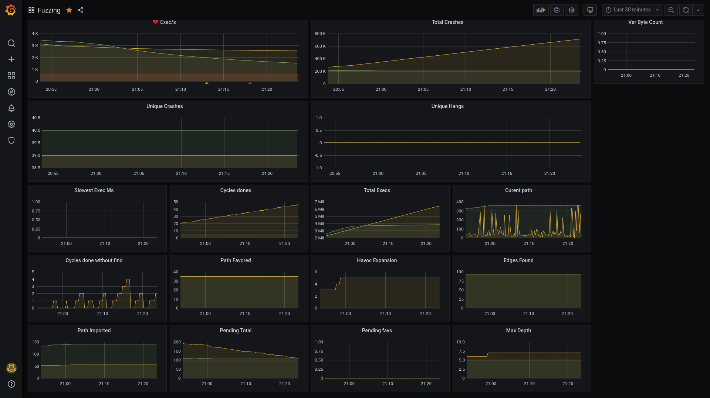

# Remote monitoring and metrics visualization

AFL++ can send out metrics as StatsD messages. For remote monitoring and
visualization of the metrics, you can set up a tool chain. For example, with
Prometheus and Grafana. All tools are free and open source.

This enables you to create nice and readable dashboards containing all the
information you need on your fuzzer instances. There is no need to write your
own statistics parsing system, deploy and maintain it to all your instances, and
sync with your graph rendering system.

Compared to the default integrated UI of AFL++, this can help you to visualize
trends and the fuzzing state over time. You might be able to see when the
fuzzing process has reached a state of no progress and visualize what are the
"best strategies" for your targets (according to your own criteria). You can do
so without logging into each instance individually.



This is an example visualization with Grafana. The dashboard can be imported
with [this JSON template](resources/grafana-afl++.json).

## AFL++ metrics and StatsD

StatsD allows you to receive and aggregate metrics from a wide range of
applications and retransmit them to a backend of your choice.

From AFL++, StatsD can receive the following metrics:
- cur_item
- cycle_done
- cycles_wo_finds
- edges_found
- execs_done
- execs_per_sec
- havoc_expansion
- max_depth
- corpus_favored
- corpus_found
- corpus_imported
- corpus_count
- pending_favs
- pending_total
- slowest_exec_ms
- total_crashes
- saved_crashes
- saved_hangs
- var_byte_count
- corpus_variable

Depending on your StatsD server, you will be able to monitor, trigger alerts, or
perform actions based on these metrics (for example: alert on slow exec/s for a
new build, threshold of crashes, time since last crash > X, and so on).

## Setting environment variables in AFL++

1. To enable the StatsD metrics collection on your fuzzer instances, set the
   environment variable `AFL_STATSD=1`. By default, AFL++ will send the metrics
   over UDP to 127.0.0.1:8125.

2. To enable tags for each metric based on their format (banner and
   afl_version), set the environment variable `AFL_STATSD_TAGS_FLAVOR`. By
   default, no tags will be added to the metrics.

    The available values are the following:
    -  `dogstatsd`
    -  `influxdb`
    -  `librato`
    -  `signalfx`

    For more information on environment variables, see
    [env_variables.md](env_variables.md).

    Note: When using multiple fuzzer instances with StatsD it is *strongly*
    recommended to set up `AFL_STATSD_TAGS_FLAVOR` to match your StatsD server.
    This will allow you to see individual fuzzer performance, detect bad ones,
    and see the progress of each strategy.

3. Optional: To set the host and port of your StatsD daemon, set
   `AFL_STATSD_HOST` and `AFL_STATSD_PORT`. The default values are `localhost`
   and `8125`.

## Installing and setting up StatsD, Prometheus, and Grafana

The easiest way to install and set up the infrastructure is with Docker and
Docker Compose.

Depending on your fuzzing setup and infrastructure, you may not want to run
these applications on your fuzzer instances. This setup may be modified before
use in a production environment; for example, adding passwords, creating volumes
for storage, tweaking the metrics gathering to get host metrics (CPU, RAM, and
so on).

For all your fuzzing instances, only one instance of Prometheus and Grafana is
required. The
[statsd exporter](https://registry.hub.docker.com/r/prom/statsd-exporter)
converts the StatsD metrics to Prometheus. If you are using a provider that
supports StatsD directly, you can skip this part of the setup."

You can create and move the infrastructure files into a directory of your
choice. The directory will store all the required configuration files.

To install and set up Prometheus and Grafana:

1. Install Docker and Docker Compose:

    ```sh
    curl -fsSL https://get.docker.com -o get-docker.sh
    sh get-docker.sh
    ```

2. Create a `docker-compose.yml` containing the following:

    ```yml
    version: '3'

    networks:
      statsd-net:
        driver: bridge

    services:
      prometheus:
        image: prom/prometheus
        container_name: prometheus
        volumes:
          - ./prometheus.yml:/prometheus.yml
        command:
          - '--config.file=/prometheus.yml'
        restart: unless-stopped
        ports:
          - "9090:9090"
        networks:
          - statsd-net

      statsd_exporter:
        image: prom/statsd-exporter
        container_name: statsd_exporter
        volumes:
          - ./statsd_mapping.yml:/statsd_mapping.yml
        command:
          - "--statsd.mapping-config=/statsd_mapping.yml"
        ports:
          - "9102:9102/tcp"
          - "8125:9125/udp"
        networks:
          - statsd-net

      grafana:
        image: grafana/grafana
        container_name: grafana
        restart: unless-stopped
        ports:
            - "3000:3000"
        networks:
          - statsd-net
    ```

3. Create a `prometheus.yml` containing the following:

    ```yml
    global:
      scrape_interval:      15s
      evaluation_interval:  15s

    scrape_configs:
      - job_name: 'fuzzing_metrics'
        static_configs:
          - targets: ['statsd_exporter:9102']
    ```

4. Create a `statsd_mapping.yml` containing the following:

    ```yml
    mappings:
    - match: "fuzzing.*"
      name: "fuzzing"
      labels:
          type: "$1"
    ```

5. Run `docker-compose up -d`.

## Running AFL++ with StatsD

To run your fuzzing instances:

```
AFL_STATSD_TAGS_FLAVOR=dogstatsd AFL_STATSD=1 afl-fuzz -M test-fuzzer-1 -i i -o o [./bin/my-application] @@
AFL_STATSD_TAGS_FLAVOR=dogstatsd AFL_STATSD=1 afl-fuzz -S test-fuzzer-2 -i i -o o [./bin/my-application] @@
...
```