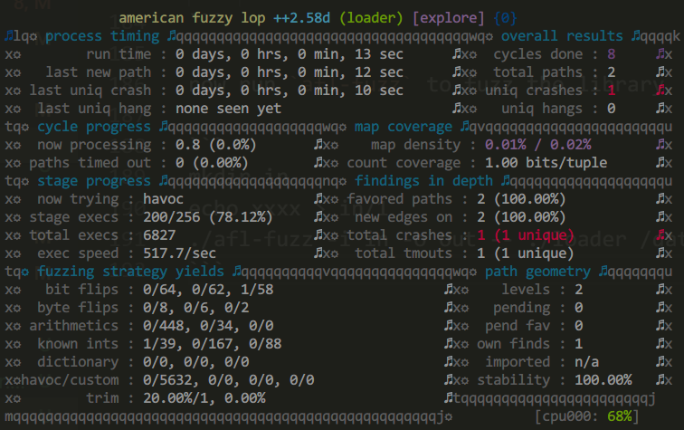

# qbdi-based binary-only instrumentation for afl-fuzz

## 1) Introduction

The code in ./qbdi_mode allows you to build a standalone feature that
using the QBDI framework to fuzz android native library.


## 2) Build

First download the Android NDK

```
https://developer.android.com/ndk/downloads
https://dl.google.com/android/repository/android-ndk-r20-linux-x86_64.zip
```

Then unzip it and build the standalone-toolchain
For x86_64 standalone-toolchain

```
unzip android-ndk-r20-linux-x86_64.zip
cd android-ndk-r20/
./build/tools/make_standalone_toolchain.py --arch x86_64 --api 21 --install-dir ../android-standalone-toolchain-x86_64
```

For x86 standalone-toolchain

```
./build/tools/make_standalone_toolchain.py --arch x86 --api 21 --install-dir ../android-standalone-toolchain-x86
```

Then download the QBDI SDK from website

```
https://qbdi.quarkslab.com/
```

For Android x86_64
```
https://github.com/QBDI/QBDI/releases/download/v0.7.0/QBDI-0.7.0-android-X86_64.tar.gz
```

Then decompress the sdk

```
mkdir android-qbdi-sdk-x86_64
cp QBDI-0.7.0-android-X86_64.tar.gz android-qbdi-sdk-x86_64/
cd android-qbdi-sdk-x86_64/
tar xvf QBDI-0.7.0-android-X86_64.tar.gz
```

Now set the `STANDALONE_TOOLCHAIN_PATH` to the path of standalone-toolchain 

```
export STANDALONE_TOOLCHAIN_PATH=/home/hac425/workspace/android-standalone-toolchain-x86_64
```

set the `QBDI_SDK_PATH` to the path of QBDI SDK

```
export QBDI_SDK_PATH=/home/hac425/workspace/AFLplusplus/qbdi_mode/android-qbdi-sdk-x86_64/
```

Then run the build.sh

```
./build.sh x86_64
```

this could build the afl-fuzz and also the qbdi template for android x86_64


### Example

The demo-so.c is an vulnerable library, it has a function for test

```
int target_func(char *buf, int size)
{
    printf("buffer:%p, size:%p\n", buf, size);
    switch (buf[0])
    {
    case 1:
        puts("222");
        if (buf[1] == '\x44')
        {
            puts("null ptr deference");
            *(char *)(0) = 1;
        }
        break;
    case 0xff:
        if (buf[2] == '\xff')
        {
            if (buf[1] == '\x44')
            {
                puts("crash....");
                *(char *)(0xdeadbeef) = 1;
            }
        }
        break;
    default:
        puts("default action");
        break;
    }

    return 1;
}
```

This could be build to `libdemo.so`.

Then we should load the library in template.cpp and find the `target` function address.
```
    void *handle = dlopen(lib_path, RTLD_LAZY);
	..........................................
	..........................................
	..........................................
    p_target_func = (target_func)dlsym(handle, "target_func");
```

then we read the data from file and call the function in `fuzz_func`

```
QBDI_NOINLINE int fuzz_func()
{
	// afl forkserver stuff
    if (afl_setup())
    {
        afl_forkserver();
    }

	// read the data from file(argv[2])
    unsigned long len = 0;
    char *data = read_file(FPATH, &len);


    printf("In fuzz_func\n");

	// call the target function with input data.
    p_target_func(data, len);
    return 1;
}
```

Just compile it
```
./build.sh x86_64
```

Then push the `afl-fuzz`, `loader`, `libdemo.so`, the `libQBDI.so` from the QBDI SDK and the `libc++_shared.so` from android-standalone-toolchain to android device

```
adb push afl-fuzz /data/local/tmp
adb push libdemo.so /data/local/tmp
adb push loader /data/local/tmp
adb push android-qbdi-sdk-x86_64/usr/local/lib/libQBDI.so /data/local/tmp
adb push ../../android-standalone-toolchain-x86_64/sysroot/usr/lib/x86_64-linux-android/libc++_shared.so
/data/local/tmp
```

In android adb shell, we could try to run the loader
```
export LD_LIBRARY_PATH=/data/local/tmp
./loader /data/local/tmp/libdemo.so init
```
the normal output like

```
# ./loader /data/local/tmp/libdemo.so init                                        p_target_func:0x7b41ac26e600
In fuzz_func
        offset:0x600
        offset:0x580
buffer:0x7b41abe2b050, size:0x4
        offset:0x628
        offset:0x646
        offset:0x64b
        offset:0x65c
        offset:0x6df
        offset:0x590
default action
        offset:0x6eb
```

now run `afl-fuzz` to fuzz the library

```
mkdir in
echo xxxx > in/1
./afl-fuzz -i in -o out -- ./loader /data/local/tmp/libdemo.so @@
```

the snapshot



good job.